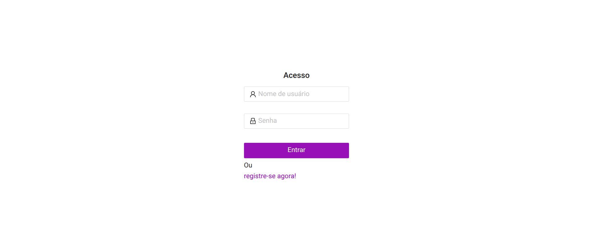
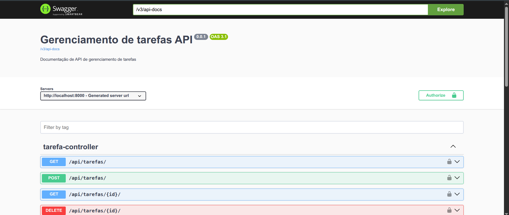

  <section align="center" style="margin-bottom: 2em">
      
    <h4>Gerenciador de tarefas 🔥 </h4>
    <div>
      <a href="#orientacoes">Orientações Gerais</a> • 
      <a href="#instrucoes">Instruções de Execução</a> •
      <a href="#funcionalidades">Funcionalidades Disponíveis</a>
    </div>
  </section>

<hr>

## <div id="orientacoes">📜 Orientações Gerais</div>

<p> A aplicação <i>FULL STACK<i> desenvolvida com Spring Boot e Angular cumpre os pontos propostos:

> Obrigatórios:

✅ a) Criar uma aplicação Front-end utilizando Angular na versão mais recente.

✅ b) Desenvolver o backend utilizando Java 21 e Spring Boot 3.

✅ c) Utilizar persistência em um banco de dados PostgreSQL e persistência JPA.

✅ d) Os endpoints devem ser em REST.

✅ e) A aplicação deverá ter um controle de login por usuário e senha e os endpoints devem autenticar através de token JWT.

> Opcionais:

❌ f) Utilizar testes de unidades.

✅ g) Documentar a API usando o Swagger (https://swagger.io).

❌ h) Publicar projeto no heroku ou outro ambiente cloud.

<hr>

## <div id="instrucoes">🔧 Instruções de Execução</div>

> Para executar o projeto, certifique-se de que sua máquina possui as seguintes ferramentas:

- [Node 22](https://nodejs.org/pt/download)
- [Angular 20](https://angular.dev/installation)
- [Java 21](https://www.oracle.com/java/technologies/downloads/#java21)
- [Maven](https://maven.apache.org/install.html)
- [PosgreSQL 16](https://www.postgresql.org/download/)

> Vamos ao passo a passo, primeiramente com o frontend:

#### Clone o repositório:

```
git clone https://github.com/alcides07/gerenciador-tarefas-full-stack.git
```

#### Acesse o diretório do frontend:

```
cd gerenciador-tarefas-full-stack/frontend/tarefas/
```

#### Instale as dependências:

```
npm install
```

#### Execute a aplicação:

```
ng serve
```

#### Acesse a aplicação frontend:

```
http://localhost:4200/
```

> Você vai se deparar com:



<br>

> Agora vamos preparar o backend.

> Se certifique que você tenha um banco de dados PostgreSQL criado que se chame `tarefas`

#### Abra um novo terminal e acesse o diretório do backend:

```
cd gerenciador-tarefas-full-stack/api/
```

#### Execute a aplicação backend:

```
mvn spring-boot:run
```

#### Acesse a documentação da API (opcional):

> A API possui documentação no Swagger. Caso deseje, acesse:

```
http://localhost:8000/docs
```

> Você vai se deparar com:



<hr>

## <div id="funcionalidades">⚙️ Funcionalidades Disponíveis</div>

- Criar conta de usuário;
- Entrar no sistema;
- Cadastrar Responsáveis;
- Cadastrar Tarefas;
- Editar Tarefas;
- Concluir Tarefas;
- Excluir Tarefas;
- Listar e filtrar tarefas.
